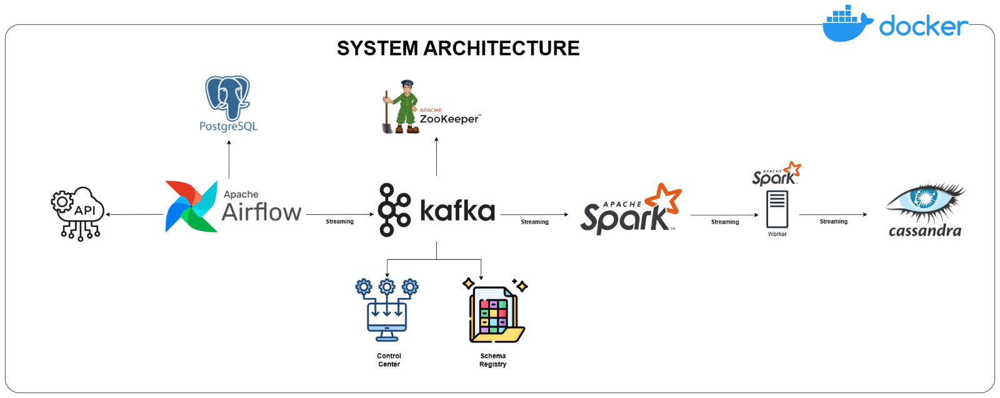

# End-to-End-Data-Engineering-Pipeline
An end-to-end data engineering pipeline that orchestrates data ingestion, processing, and storage using Apache Airflow, Python, Apache Kafka, Apache Zookeeper, Apache Spark, and Cassandra. All components are containerized with Docker for easy deployment and scalability. 
---
## 🏗️ System Architecture

The system architecture for this project :

---
The project is designed with the following components:

    Data Source: We use randomuser.me API to generate random user data for our pipeline.
    Apache Airflow: Responsible for orchestrating the pipeline and storing fetched data in a PostgreSQL database.
    Apache Kafka and Zookeeper: Used for streaming data from PostgreSQL to the processing engine.
    Control Center and Schema Registry: Helps in monitoring and schema management of our Kafka streams.
    Apache Spark: For data processing with its master and worker nodes.
    Cassandra: Where the processed data will be stored.
-----

Technologies

    Apache Airflow
    Python
    Apache Kafka
    Apache Zookeeper
    Apache Spark
    Cassandra
    PostgreSQL
    Docker
